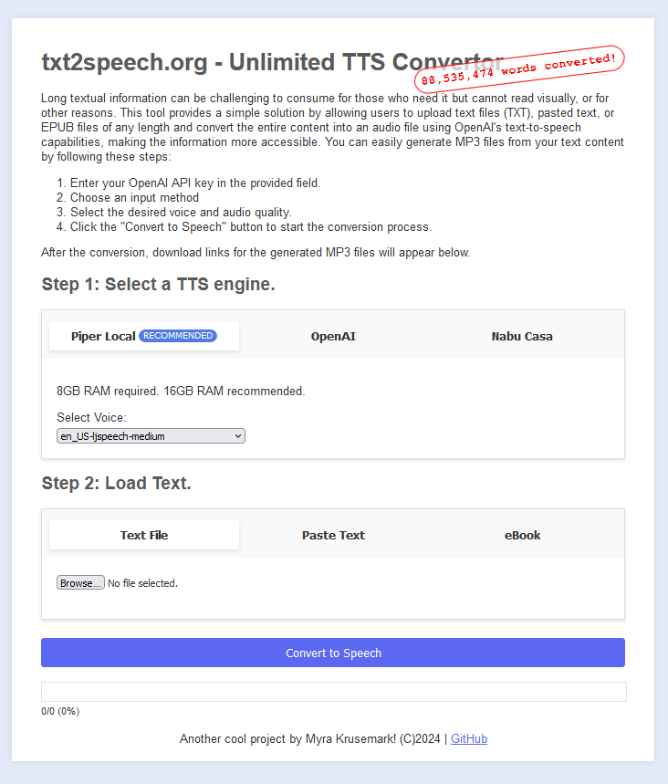

# txt2speech.org - Unlimited TTS Convertor



txt2speech.org is a web-based tool that allows users to convert long textual information into audio files using various text-to-speech (TTS) engines. It provides a simple solution for making text content more accessible to those who cannot read visually or for other reasons.

## Features

- Support for multiple TTS engines:
  - Piper Local (recommended)
  - OpenAI
  - Nabu Casa
- Input methods:
  - Upload text files (TXT)
  - Paste text directly
  - Upload EPUB files
- Select desired voice and audio quality
- Generate MP3 files from text content
- Progress tracking and estimated cost display

## Usage

1. Select a TTS engine (Piper Local, OpenAI, or Nabu Casa).
2. Enter the required API key or server details for the selected engine.
3. Choose an input method (text file, pasted text, or EPUB).
4. Select the desired voice and audio quality.
5. Click the "Convert to Speech" button to start the conversion process.
6. Download the generated MP3 files once the conversion is complete.

## Running Locally

To run txt2speech.org locally, follow these steps:

1. Clone the repository or download the source code.
2. Navigate to the project directory.
3. Create a file named `serve.py` with the following content:

   ```python
   import http.server
   import socketserver

   PORT = 8080
   Handler = http.server.SimpleHTTPRequestHandler

   with socketserver.TCPServer(("", PORT), Handler) as httpd:
       print(f"Serving at port {PORT}")
       httpd.serve_forever()
   ```

4. Open a terminal or command prompt and run the following command:

   ```
   python serve.py
   ```

5. Open a web browser and visit `http://localhost:8080` to access the application.

## Disclaimer

Please read the following disclaimer carefully before using txt2speech.org:

- **Use of Text:** Users are responsible for ensuring they have the appropriate rights to convert any text files uploaded using this tool. This service should not be used to infringe on the copyright of any texts.

- **API Key:** Users must use their own API keys for the selected TTS engine. The entered API key is saved to a local cookie in the browser and is only stored locally on the user's device. Users assume all responsibility for usage charges and adherence to the TTS engine's usage policies and terms.

- **Accuracy and Liability:** While we strive to provide a high-quality service, we do not guarantee that the text-to-speech conversion will be error-free or uninterrupted. We shall not be held liable for any damages arising out of the use of this tool.

- **No Warranties:** This service is provided "as is" without any representations or warranties, express or implied.

- **Terms of Use:** By using txt2speech.org, users agree to abide by the terms of use, including using the service for lawful purposes, not redistributing the outputs without proper authorization, and acknowledging that the service availability may be affected by technical issues or updates.

- **Data Handling:** All text-to-speech processing is performed locally in the user's browser. No text files or data are uploaded to a server. We do not store any personal data or text files used with this tool.

- **OpenAI and Nabu Casa API Compliance:** Users must comply with the respective API compliance guidelines, including API key security, acceptable use, data protection, and rate limits.

- **Piper Licensing:** The Piper software is released under the MIT License. By using Piper, you agree to the terms of this license.

By using txt2speech.org, you accept this disclaimer in full. If you disagree with any part of this disclaimer, do not use our website.

For more information, please refer to the detailed sections on OpenAI API Compliance, Nabu Casa API Compliance, and Piper Licensing within the application.