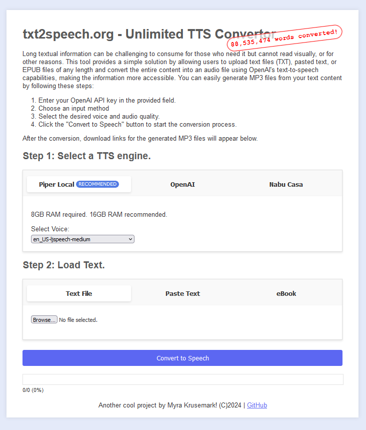

# txt2speech.org - Unlimited TTS Converter

txt2speech.org is a web-based tool that converts long-form text into audio files. It provides a simple solution for making text content more accessible to those who cannot read visually or for other reasons.

## Features

- Support for multiple TTS engines:
  - **Kokoro (recommended)** — free, unlimited, runs entirely in your browser via [kokoro-js](https://www.npmjs.com/package/kokoro-js) (WebGPU with WASM fallback). The ~90–330 MB voice model downloads once and is cached. English voices only.
  - **OpenAI** — requires your own API key.
  - **Nabu Casa** — for Home Assistant Cloud users; requires your server address and bearer token.
- Input methods: paste text, type directly, or upload a .txt file
- Live preview — listen while the conversion is still running
- In-page playback of the finished audio plus WAV/MP3 download
- Long texts are processed in chunks with progress tracking; interrupted conversions can be resumed after a page reload
- Screen-reader friendly: live progress announcements, keyboard operable (Ctrl+Enter converts)

## Usage

1. Paste, type, or upload your text.
2. (Optional) Open Settings to pick an engine and voice. Kokoro is the default and needs no account.
3. Click **Convert**. With Kokoro, the first run downloads the model — later runs start instantly.
4. Press the preview play button to listen while it converts, or wait and use the player/download link in Output File.

## Running Locally

1. Clone the repository.
2. Run `python serve.py` in the project directory.
3. Open `http://localhost:8081`.

## Disclaimer

Please read the following disclaimer carefully before using txt2speech.org:

- **Use of Text:** Users are responsible for ensuring they have the appropriate rights to convert any text files uploaded using this tool. This service should not be used to infringe on the copyright of any texts.

- **API Keys:** Users must use their own API keys for the OpenAI and Nabu Casa engines. Entered credentials are saved to a local cookie in the browser and are only stored locally on the user's device. Users assume all responsibility for usage charges and adherence to the TTS engine's usage policies and terms.

- **Accuracy and Liability:** While we strive to provide a high-quality service, we do not guarantee that the text-to-speech conversion will be error-free or uninterrupted. We shall not be held liable for any damages arising out of the use of this tool.

- **No Warranties:** This service is provided "as is" without any representations or warranties, express or implied.

- **Data Handling:** Kokoro processing is performed locally in the user's browser; no text or audio leaves the device. OpenAI and Nabu Casa conversions send text to those services under their respective policies. We do not store any personal data or text files used with this tool.

- **Kokoro Licensing:** The Kokoro-82M model and kokoro-js library are released under the Apache 2.0 license.

By using txt2speech.org, you accept this disclaimer in full. If you disagree with any part of this disclaimer, do not use our website.
